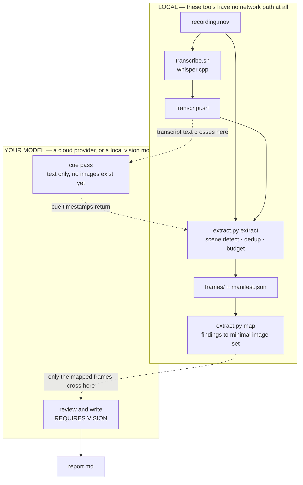

# Video Review

Turns a local screen recording into a cited written document — a defect log, a runbook, or footage notes — where every claim traces to a timestamp and a frame.

This is a **video-to-document skill** — it transcribes locally, picks the moments worth seeing, extracts only those frames, and writes the document. It does not edit or assemble video.

**See it before you install anything: [a complete worked example](example/), including [the report it produces](example/report.md).** 24 seconds of video, three cues, two images, four honestly declared gaps.

## Known limits

Read these before deciding whether this fits, not after.

- **Local video files only.** No URL or hosted-video ingest, deliberately. See [DECISIONS.md](DECISIONS.md) for the reasoning and the trigger that would change it.
- **It costs real tokens, and the cost scales with the recording.** A 17-minute walkthrough runs around 135k visual tokens at default effort. The first step prints the estimate before anything is spent, and it is a genuine gate — do not skip past it on someone else's behalf.
- **Very small text changes will be missed by the visual sweep.** They fall below the deduplication threshold. Anything said out loud is still caught, because spoken moments are pinned separately.
- **Whisper mis-hears product names**, confidently. "Smooth Matte" came back as "smooth Mac". The skill checks odd nouns against the frame and flags what it cannot confirm, but you should still read proper nouns with suspicion.
- **The transcript is measurably messier than it reads.** On one 17-minute recording at `large-v3`: 28% of segments had **zero duration**, 36% **repeated the previous segment**, and the last 25 collapsed into 5 distinct sentences — a hallucination loop, not dropped audio. Timecodes drift about half a second on top of that. None of it errors. The frames are the check on this: they carry real `ffprobe` timestamps, so a mis-timed cue shows up on inspection. If exact timing matters, cross-check against a second model.
- **Requires a local setup** — whisper.cpp, ffmpeg, Pillow, and a model file of up to ~2.9 GB. This is not a paste-into-a-Project skill.
- **Your agent must be able to see images and run shell commands.** A text-only model can do the cue pass and write prose but cannot verify one claim against a frame, which turns the output into a transcript summary formatted like a defect log — worse than nothing, because it looks checked.
- **Only the defect-log archetype has been validated end to end.** Runbook and footage notes are built from the same machinery and follow the same rules, but no real run has been measured for either. Treat them as usable and unproven.
- **macOS filename trap:** screen-recording filenames contain a U+202F narrow no-break space before "pm". It looks like an ordinary space, so a retyped path fails with "video not found". Glob the filename instead of typing it.

## What actually leaves your machine

Worth being exact about, because the material is usually more sensitive than it looks — someone narrating a walkthrough is talking over unreleased features, pre-launch pricing, and customer data on screen.



**The bundled tools contain no network path and no telemetry.** That is a property of the executables and you can check it: `grep -rnoE 'https?://' tools/` returns documentation links and package sources, nothing else. Transcription, frame extraction, deduplication and evidence packaging never send anything anywhere.

Note what the diagram makes obvious: **there are exactly two crossings**, and the tools decide how much goes through the second one. On a real 17-minute walkthrough, 69 distinct frames were extracted locally and **32 crossed** — the mapping step is a privacy control as much as a cost one.

**But two stages need a model to think**, and those go wherever your agent host goes:

| Stage | Runs where |
|---|---|
| Transcription, extraction, deduplication, packaging | **Always local.** No network path exists. |
| Picking which moments deserve a frame | Your configured model — reads **transcript text** |
| Reading the frames and writing the document | Your configured model — reads **selected frames** |

So there are two honest deployment modes:

- **Cloud-assisted** (what most people will run). Preprocessing is local; the selected transcript text and the selected frames are sent to your provider. **Assume anything visible in a cited frame has been sent.** Redact or avoid customer data and credentials on screen, or crop the recording before you start.
- **Fully local.** The same preprocessing, with a local vision-capable agent doing the two reasoning stages. Nothing leaves the machine at all. This needs a host that can see images — a text-only local model can do the cue pass but cannot do the visual review, which is the half that makes the output trustworthy.

Two more boundaries worth stating plainly: the optional model-assisted transcript cleanup follows the same rule as your agent host, and **first-time setup does download** ffmpeg, whisper.cpp and a model file over the network, even though nothing you later process is uploaded.

### What each stage needs, and what it costs you if you lack it

| Stage | Runs on | Needs | Without it |
|---|---|---|---|
| Transcribe | whisper.cpp | shell, ~2.9 GB model | No transcript, so no cue pass. Supply your own `.srt` and the rest still works. |
| Extract / dedup | ffmpeg + Pillow | shell, filesystem | Nothing works. This is the tool. |
| Cue pass | your model | text only | Falls back to the visual sweep alone — you keep the frames, you lose "the moments someone said mattered". |
| Map | Python + Pillow | filesystem | Still works, but you read the whole folder: ~120k tokens instead of ~56k on a real run. |
| Review + write | your model | **vision** | **The output stops being trustworthy.** No claim can be checked against a frame, so everything becomes unverified — a transcript summary in a defect log's clothing. |
| Sub-agents | optional | — | Cue pass runs in the main thread instead. Costs context, changes nothing else. |

The row that decides whether this skill is usable at all is **vision**. Everything else degrades gracefully.

## What it handles

- A recorded walkthrough where you narrated problems → a defect log for developers, with a "verified correct" list of what not to touch
- A recording of how something is done → a runbook with the exact steps and values
- An interview or marketing recording → quotable lines with in/out timecodes and notes on what is usable
- Going back for a moment the first pass missed, without re-sending anything already reviewed

## How to invoke it

Type `/video-review` in your Claude Code session, or describe what you want:

- "review this video"
- "watch this walkthrough"
- "turn this recording into a task list"
- "what did I flag in this recording?"
- "write up this recording"

## Key behaviours

- **A gap is declared, never filled.** If a frame does not show what the narration describes, that is written down as an open gap with the command to go and fetch it — not reasoned into a plausible-sounding finding. On the first real run this caught a narrated claim that its own frame contradicted, which would otherwise have gone to developers as a bug that did not exist.
- **Cost is shown before it is spent.** The probe step writes nothing and prints the estimate for all three effort levels.
- **Reactions and findings stay separate.** "I don't love this" is an open question; "this is wrong" is a finding. They go to different people.
- **Every deterministic stage is local, and the reasoning stages go wherever your agent goes.** Transcription, extraction, deduplication and packaging run on your machine with no network path at all. Cue selection and reading the frames are done by a model — so on a cloud host, selected transcript text and selected frames are sent to that provider. See [What actually leaves your machine](#what-actually-leaves-your-machine).
- **Findings are mapped to frames before any frame is read.** Several findings routinely land on one image, so reading the mapped set rather than the folder cut a real run from ~167k visual tokens to ~49k for the same document.
- **Product names get harvested back into the glossary** after you confirm them on screen, so the next recording in the same domain does not repeat the same mistranscriptions.

## Tools it needs

Unlike most skills here, this one drives two real programs. Copy both:

| Tool | What it does |
|---|---|
| [`tools/transcription/`](../../tools/transcription/) | Local whisper.cpp transcription with glossary priming |
| [`tools/video-frames/`](../../tools/video-frames/) | Decides which frames are worth paying for, and extracts them |

Setup is [`tools/transcription/SETUP.md`](../../tools/transcription/SETUP.md) — it covers everything both tools need, including the frame extractor's dependencies. Three installs and one model download.

**Tell your agent where they landed.** The example commands are written `tools/video-frames/extract.py`, which only resolves if you happen to be standing at the root of the workspace you copied them into. Set these once and the commands work from anywhere:

```bash
export VF=/absolute/path/to/tools/video-frames
export TR=/absolute/path/to/tools/transcription

python3 "$VF/extract.py" probe recording.mov      # then use $VF / $TR throughout
```

The tools resolve their *own* dependencies relative to their own location — `transcribe.sh` finds its model whatever directory you call it from — so this is the only path that needs telling.

## Which agents this works with

The deterministic half is plain ffmpeg, whisper.cpp and Python, so nothing here is tied to one vendor. What it needs from a host is **shell access, filesystem access, and a model that can see images.**

| Host | Works? |
|---|---|
| **Claude Code** | Yes, and it is what this was built and verified on. Install per the repo README; invoke with `/video-review`. |
| **Codex or another coding agent** | Yes. Point the agent at `SKILL.md` and set `VF`/`TR` as above. Treat the token estimate as Claude's arithmetic — the frame counts are the provider-neutral number. |
| **A local vision-capable agent** | Yes, and this is the only configuration where **nothing leaves the machine at all**. Same workflow; the two reasoning stages run on your local model. |
| **Browser-only chat** (ChatGPT, Claude.ai without tools) | **No.** Not a documentation gap — the pipeline needs to run programs and read files, and a chat window cannot. Paste-in skills work; this one does not. |

Verified from a directory outside the repo, on a copy installed into a separate workspace: `probe` → `extract` → `map` → read the frames, all through `$VF`. The only thing that fails is the bare relative path, which is what the export above is for.

## Customise for your context

- **Start a glossary** for whatever you record most. Copy `tools/transcription/glossaries/_template.txt`, add the product and people names, and the transcript stops mangling them. Two minutes, and it pays back on every future recording. Only add spellings you are certain of — a wrong one actively biases the transcript toward the wrong spelling.
- **Add a `_global.txt` glossary** if some names recur across everything you record. Not shipped here, because yours would be nothing like anyone else's.
- **Pick your archetype** in `SKILL.md`'s Step 0 table. The three provided (defect log, runbook, footage notes) differ in *content*, not formatting. If you produce a fourth kind of document regularly, add a row rather than bending an existing one.

## Why the defaults are what they are

[DECISIONS.md](DECISIONS.md) records what was tried, what was measured, and what was rejected — including two cases where the standard, obvious approach was measurably wrong, and one bug that was introduced by the fix for another bug. If you are evaluating whether to trust this, that is the file to read.
