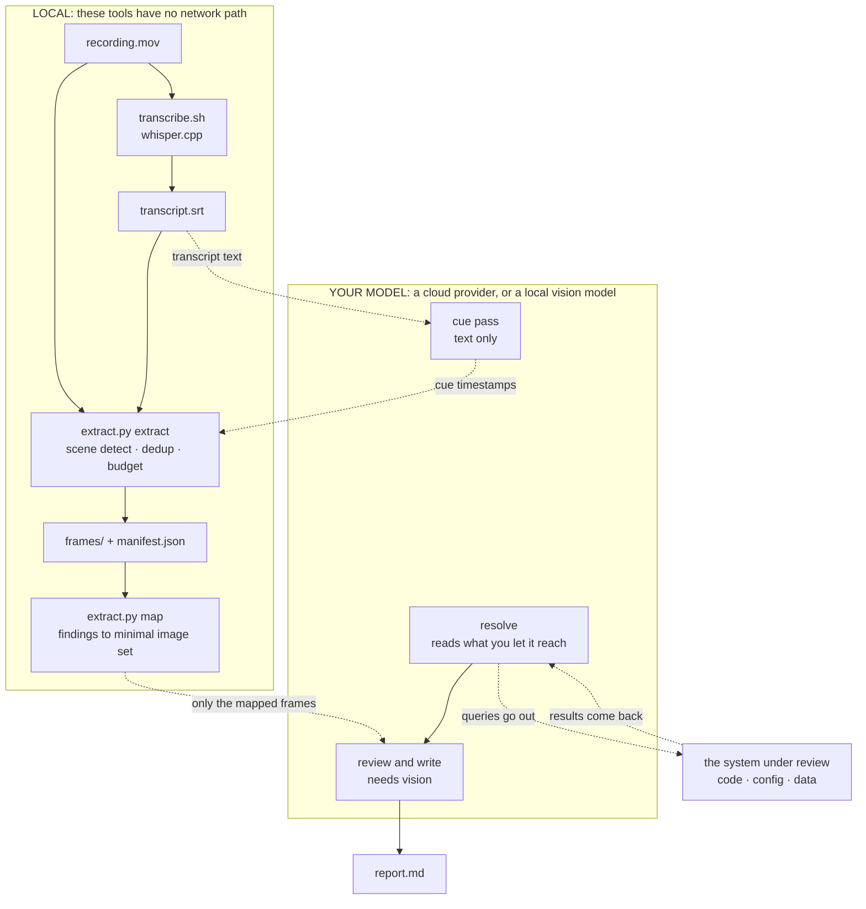

# Video Review

Turns a local screen recording into a written document: a defect log, a runbook, or footage notes. Every claim cites a timestamp and a frame, and every defect-log item is checked against the code, config or data where the agent can reach them, then written as error, location, fix and owner.

It transcribes locally, picks the moments worth seeing, extracts only those frames, resolves each item, and writes the document. It doesn't edit video.

See [the worked example](example/) and [the report it produces](example/report.md) before installing anything.

## Known limits

- Local video files only.
- It costs real tokens: a 17-minute walkthrough is about 135k visual tokens at default effort. The first step prints the estimate before anything is spent.
- Very small text changes fall below the visual threshold. Anything said out loud is still caught.
- Whisper mishears product names ("Smooth Matte" came back as "smooth Mac"), and its timings drift. The skill checks odd nouns against the frame; read proper nouns with suspicion anyway.
- Only the defect log has been validated on real footage. Runbooks and footage notes use the same machinery and are less tested.
- macOS screen-recording filenames contain a narrow no-break space before "pm", so a retyped path fails. Glob the name instead.


## First run

1. Copy this folder into your `skills/`, plus [`tools/transcription/`](../../tools/transcription/) and [`tools/video-frames/`](../../tools/video-frames/).
2. Follow [`tools/transcription/SETUP.md`](../../tools/transcription/SETUP.md): three installs and one model download, covering both tools.
3. Tell your agent where the tools are:

```bash
export VF=/absolute/path/to/tools/video-frames
export TR=/absolute/path/to/tools/transcription
python3 "$VF/extract.py" probe recording.mov    # writes nothing; prints the cost
```

4. Say "review this video", or type `/video-review`.

## What your agent needs

**Shell access, filesystem access, and a model that can see images.** It works in Claude Code, Codex or any coding agent that can read `SKILL.md`, and with a local vision model. It doesn't work in a browser-only chat, which can't run programs.

**Read access to whatever the recording shows** (the repo, config, a database or admin screen) makes the difference between a task list and a list of questions. Without it, most items come back marked blocked.

## What leaves your machine

Walkthroughs are usually more sensitive than they look: unreleased features, pricing, customer data on screen.


```mermaid
flowchart TD
    A["recording.mov"] --> B["transcribe.sh<br/>whisper.cpp"]
    B --> C["transcript.srt"]
    A --> E["extract.py extract<br/>scene detect · dedup · budget"]
    C --> E
    E --> F["frames/ + manifest.json"]
    F --> G["extract.py map<br/>findings to minimal image set"]

    subgraph local["LOCAL: these tools have no network path"]
        A
        B
        C
        E
        F
        G
    end

    C -. "transcript text" .-> H
    G -. "only the mapped frames" .-> I

    subgraph model["YOUR MODEL: a cloud provider, or a local vision model"]
        H["cue pass<br/>text only"]
        R["resolve<br/>reads what you let it reach"]
        I["review and write<br/>needs vision"]
    end

    R -. "queries go out" .-> S["the system under review<br/>code · config · data"]
    S -. "results come back" .-> R

    H -. "cue timestamps" .-> E
    R --> I
    I --> J["report.md"]
```

The bundled tools have no network path and no telemetry; `grep -rnoE 'https?://' tools/` returns only documentation links and package sources. Three things reach your model: the full transcript (the cue pass reads all of it, as does the optional cleanup pass), the mapped frames (on one 17-minute walkthrough, 28 of 96 extracted), and whatever the resolve step reads.

- **Cloud-assisted**, which is what most people run: assume anything said aloud, and anything visible in a cited frame, has been sent. Crop or avoid customer data and credentials on screen.
- **Fully local**, with a local vision model: nothing leaves the machine except the queries the resolve step sends to systems you point it at, and those can carry values read off the recording, such as an order number.

First-time setup downloads ffmpeg, whisper.cpp and a model file. Nothing you process afterwards is uploaded by the tools.

## If a piece is missing

| Missing | What happens |
|---|---|
| Transcription | Supply your own `.srt`; everything else still works |
| Cue pass | You keep the visual sweep but lose the moments someone said mattered |
| Mapping | You read the whole folder: about 167k visual tokens instead of 49k on a real run |
| Access to the system | Items can be written, but most are blocked |
| **Vision** | **Nothing can be checked against a frame.** The output looks like a defect log and isn't one |

## Customise it

- **Start a glossary** for what you record most: copy `tools/transcription/glossaries/_template.txt` and add product and people names. Add only spellings you're sure of.
- **Add a `_global.txt` glossary** for names that recur across everything.
- **Add a document type** as a new row in `SKILL.md`'s step 0 table rather than bending an existing one.

[DECISIONS.md](DECISIONS.md) has why the defaults are what they are, with the measurements.
